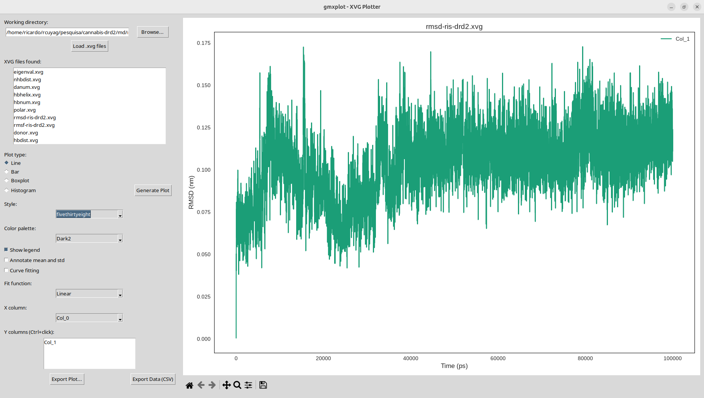
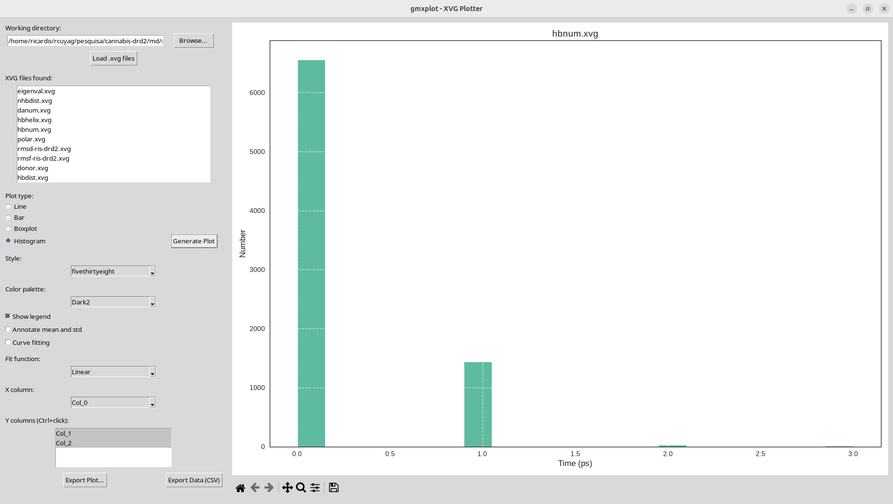
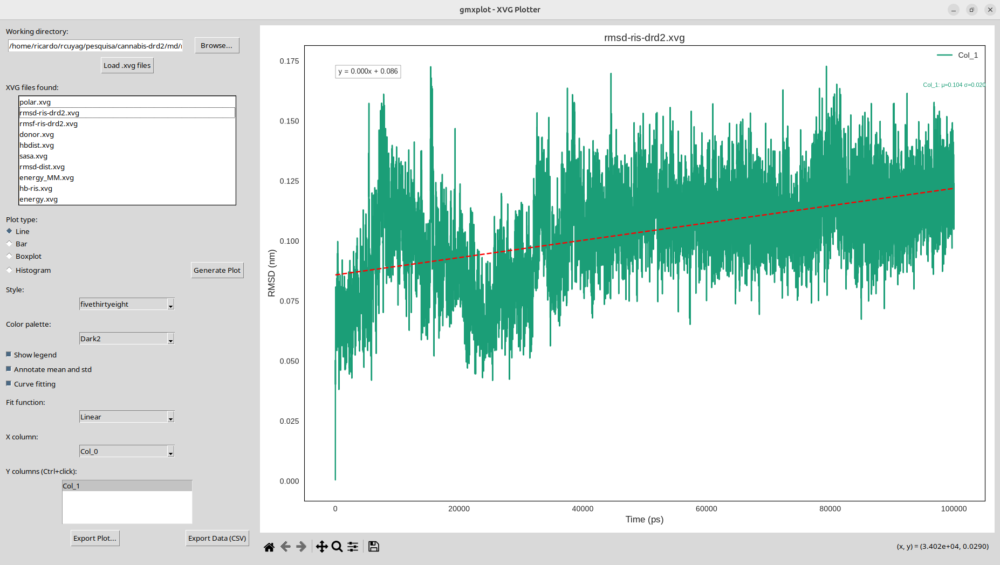

This is the latest version of gmxplot (v1.1), as new features have been added.

Author: Teobaldo Cuya
Dep. of Physics, Mathematics and Computing
Faculty of Tecnhology
Universidade do Estado de Rio de Janeiro


# gmxplot – Advanced Statistical Analysis for GROMACS XVG Files

[](https://www.python.org/downloads/)
[](https://doi.org/10.5281/zenodo.20779020)
[](https://www.gnu.org/licenses/gpl-3.0)

**gmxplot** is a comprehensive GUI-based tool for advanced statistical analysis of time-series data generated by GROMACS molecular dynamics simulations. It goes far beyond simple plotting, offering a suite of rigorous statistical methods to assess convergence, detect correlations, characterise dynamics, and extract thermodynamic profiles directly from `.xvg` output files.

---

## ✨ What does gmxplot do?

gmxplot transforms raw GROMACS output into publication‑ready graphics and quantitative insights. It is designed for researchers who need to:

- **Visualise** trajectories (RMSD, Rg, SASA, dihedrals, energies, etc.) with high‑quality line, bar, histogram, ECDF, and 2D density (FES) plots.
- **Estimate realistic errors** using the Flyvbjerg–Petersen block‑averaging method, which accounts for temporal correlations.
- **Assess convergence** via SEM evolution, block averaging, and distribution comparison (KS test).
- **Detect outliers** and identify transient events.
- **Reveal dynamical couplings** through cross‑correlation, FFT spectra, and correlation matrices.
- **Characterise diffusive behaviour** with Hurst exponent (DFA) and sample entropy (ApEn).
- **Compute free‑energy profiles** (PMF) from histograms.
- **Perform unsupervised clustering** (k‑means) and principal component analysis (PCA) on multiple observables.
- **Export statistical summaries** in LaTeX table format for manuscripts.

---

## 🔬 Why is this useful in Molecular Dynamics?

Molecular dynamics simulations produce vast amounts of time‑dependent data. The key questions are:

- *Is my simulation converged?* – SEM evolution and block convergence tell you when the average is stable.
- *Are my observables correlated?* – Cross‑correlation reveals causal relationships (e.g., ligand binding precedes conformational change).
- *What is the dominant motion?* – FFT and PCA extract periodic and collective motions.
- *How rough is the energy landscape?* – Hurst exponent and entropy quantify diffusivity and complexity.
- *What is the free‑energy cost of a transition?* – PMF profiles give thermodynamic barriers.

gmxplot answers these questions in a few clicks, without requiring command‑line coding.

---

## 📦 Installation

### Dependencies
- Python 3.6 or higher
- Required: `numpy`, `pandas`, `matplotlib`, `scipy`, `statsmodels`
- Optional (but recommended): `seaborn`, `scikit-learn`, `nolds`, `customtkinter`

Install with pip:

```bash
pip install numpy pandas matplotlib scipy statsmodels seaborn scikit-learn nolds customtkinter
Note: If customtkinter is not installed, the GUI falls back to standard Tkinter.

Run the program
bash
python gmxplot.py
🖥️ User Interface Overview
The main window is divided into two panels:

Left panel – Controls for loading files, selecting columns, choosing plot types, adjusting smoothing, and launching advanced analyses.

Right panel – Notebook tabs where each new plot appears. Each tab includes a toolbar for zooming, panning, and saving the figure, plus a bottom bar to customise axis labels, legend, and time cropping.

📘 Step‑by‑Step Tutorial
1. Load an XVG file
Click "Load .xvg file" and select any GROMACS .xvg output (e.g., rmsd.xvg, rg.xvg, sasa.xvg, energy.xvg).

The file is parsed; column names appear in the dropdown menus.

Select the X Column (usually time) and one or more Y Columns (the observables).

2. Generate a standard plot
Choose a Plot Type:

Line – for time series.

Bar – for binned or discrete data.

Histogram – for distribution analysis.

ECDF – empirical cumulative distribution (requires statsmodels).

2D Density/FES – free‑energy surface from two observables.

Toggle "Show Legend" and "Real Error (Block Averaging)" as needed.

Adjust Smoothing (Savitzky–Golay filter) to reduce noise.

Click "GENERATE PLOT" – the graph appears in a new tab.

3. Calculate Correlation Time (τ)
This is a dedicated function for autocorrelation functions (e.g., from gmx acf).

Click "Calculate Correlation Time" and select your ac.xvg file.

The program integrates the ACF up to the first zero crossing to compute τ.

The result is displayed on the plot with the formula.

4. Advanced Statistical Analyses
From the "Advanced Analysis" dropdown, choose one of the many methods (see list below). Then click "RUN ADVANCED ANALYSIS".

Analysis	What it does
SEM Evolution	Plots standard error of the mean vs. time – helps assess convergence.
Block Convergence	Divides the trajectory into blocks; plots block means with error bars.
Outlier Detection	Marks points deviating >3σ from the mean.
Cross‑correlation	(Select two Y columns or two files) – computes correlation vs. lag.
FFT Spectrum	Power spectrum of the signal to identify periodic motions.
Hurst Exponent (DFA)	Quantifies long‑range memory (persistent/anti‑persistent behaviour).
Distribution Comparison	Compares first vs. second half using KS test and overlaid histograms.
Correlation Matrix	(Select two files or multiple columns) – Pearson correlation heatmap.
PMF (Energy Profile)	Free energy as a function of the selected coordinate (in kT).
Clustering (k‑means)	Groups frames into clusters based on the time series (raw or smoothed).
PCA (Principal Components)	Projects multidimensional data onto principal components.
Error vs Sampling Interval	Shows how subsampling affects the error – helps choose saving frequency.
3D Visualization	(Select two Y columns or two files) – time vs. two properties in 3D.
Export Stats (LaTeX/CSV)	Generates a LaTeX table with mean, error, and effective sample size.
Fitting (linear)	Fits a straight line to the entire series.
Sample Entropy (ApEn)	Measures signal complexity (chaotic vs. regular).
Variance Evolution	Sliding‑window variance – detects changes in flexibility.
For Cross‑correlation, Correlation Matrix, and 3D Visualization you can either:

Use a single loaded file with two Y columns, or

Select two separate .xvg files (Ctrl+click) – the program will check that their time columns match.

🔧 Generating Input Files from GROMACS
gmxplot reads standard GROMACS .xvg files. Here are common commands to generate them:

RMSD (backbone)
bash
gmx rms -s topol.tpr -f traj.xtc -o rmsd.xvg -fit rot+trans < /dev/null
# Choose the reference structure (e.g., 0 for the first frame)
Radius of gyration (Rg)
bash
gmx gyrate -s topol.tpr -f traj.xtc -o rg.xvg
Solvent Accessible Surface Area (SASA)
bash
gmx sasa -s topol.tpr -f traj.xtc -o sasa.xvg
Energy terms (potential, kinetic, etc.)
bash
gmx energy -f ener.edr -o energy.xvg
# Then select the energy terms you want (e.g., Potential, Temperature)
Autocorrelation function (ACF)
bash
gmx acf -f rmsd.xvg -o acf.xvg
# This computes the ACF of the property; useful for correlation time.
Hydrogen bonds
bash
gmx hbond -s topol.tpr -f traj.xtc -num hbonds.xvg
Distance between two groups
bash
gmx distance -s topol.tpr -f traj.xtc -o dist.xvg -select 'residue 10' -select 'residue 20'
Dihedral angles
bash
gmx angle -s topol.tpr -f traj.xtc -o dihedral.xvg -type dihedral
📖 Example Workflow
Scenario: You have a 100 ns simulation of a protein. You want to know:

Is the RMSD converged?

Is Rg correlated with RMSD?

What is the dominant frequency of motion?

Workflow:

Load rmsd.xvg and rg.xvg (load first, then load the second using "Load .xvg file" again – they will be appended).

Generate a line plot of RMSD – check for plateau.

Run SEM Evolution – if the SEM flattens, the average is converged.

Run Cross‑correlation selecting RMSD and Rg – look for a peak lag (e.g., positive lag means RMSD leads Rg).

Run FFT Spectrum on RMSD – identify the peak frequency (e.g., 0.1 ns⁻¹ corresponds to a 10 ns periodic motion).

Export the plots and stats for your manuscript.

📝 How to Cite
If you use gmxplot in your research, please cite:

Cuya, T. (2020). gmxplot: Advanced Statistical Analysis for GROMACS XVG Files. Zenodo. https://doi.org/10.5281/zenodo.20779020


🙏 Acknowledgements
This software was developed at the Laboratório de Computação Avançada em Modelagem Molecular (LCAMM) ,
Faculty of Technology, Rio de Janeiro State University (UERJ) , Brazil.

We thank the GROMACS community for providing the simulation engine that generates the data this tool analyses.

⚖️ License
gmxplot is distributed under the GNU General Public License v3.0.
See the LICENSE file for details.

📬 Contact & Support
For questions, bug reports, or feature requests, please open an issue on the GitHub repository or contact the author at teobaldo.cuya@uerj.br.






